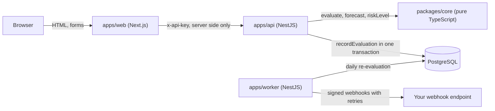

# blockpace

[](https://github.com/alihdrndm/blockpace/actions/workflows/ci.yml)

blockpace turns a hotel room-block contract and a series of pickup reports into one number a planner can act on: how much attrition damage the group owes today, and how much it is on course to owe at cutoff.

## The problem

When you book a room block for an event, you promise the hotel that your group will use a number of room nights, say 200. The contract allows some allowed attrition, often 10 to 20 percent; below that minimum, the group pays damages for rooms nobody used. Whether money is owed depends on details that are easy to get wrong in a spreadsheet: is the minimum measured on the total of all nights (cumulative basis) or night by night (per-night basis, where a strong Saturday cannot make up for a weak Thursday)? What share of the room rate is charged, and does the hotel give resell credit for rooms it sold again? Pickup arrives as a snapshot from the hotel every week or so, and the numbers only matter if you see them before the cutoff date, when unreserved rooms are released. Most planners learn the answer after the cutoff, when nothing can be done. blockpace calculates the damages owed today and projects pickup to the cutoff, so you know whether a block is on track, at risk or already liable while there is still time to act.

## Quick start

You need Node.js 24, pnpm (via `corepack enable`) and Docker running.

```bash
git clone https://github.com/alihdrndm/blockpace.git
cd blockpace
pnpm install
pnpm db:up && pnpm db:reset   # creates .env, starts PostgreSQL on port 5442, loads 3 demo blocks
pnpm dev                      # API, worker, web dashboard and webhook sink, all with hot reload
```

Then open:

- **http://localhost:3020**: the dashboard with the three demo blocks.
- **http://localhost:4020/docs**: the interactive API documentation.

Locally `API_KEY` is empty, so authentication is off (the API logs a warning). To run the whole stack in containers instead, with authentication on (key `local-dev-key`), use `docker compose up --build`; the examples below use that.

## Try it

Against `docker compose up --build`. Amounts are in minor units (cents); the demo data is created relative to today, so dates move with the day you run it.

**1. Health check (no key needed)**

```bash
curl localhost:4020/healthz
```
```json
{"status":"ok"}
```

**2. The three demo blocks and today's risk** (output reduced to name, hotel, risk, owed today, projected at cutoff)

```bash
curl -H "x-api-key: local-dev-key" localhost:4020/v1/blocks
```
```text
Sales Kickoff | Lakeside Resort  | met      | 0      | 0
TechConf      | Courtyard Annex  | at_risk  | 690240 | 105120
TechConf      | Harborview Hotel | on_track | 666660 | 0
```

The two TechConf blocks have identical rooms and pickup. Only the basis differs: measured night by night, Courtyard Annex is still projected to owe $1,051.20 at cutoff; measured on the total, Harborview is on track to owe nothing.

**3. Calculate without saving anything** (output reduced to the key fields)

```bash
curl -H "x-api-key: local-dev-key" -H "content-type: application/json" \
  localhost:4020/v1/calculations/attrition -d '{
  "currency": "USD",
  "terms": { "basis": "per_night", "allowedAttritionPct": 15, "damagesPct": 80 },
  "nights": [
    { "date": "2026-11-10", "contractedRooms": 45, "rateMinor": 18900, "pickedUpRooms": 40 },
    { "date": "2026-11-11", "contractedRooms": 60, "rateMinor": 18900, "pickedUpRooms": 49 },
    { "date": "2026-11-12", "contractedRooms": 60, "rateMinor": 21900, "pickedUpRooms": 44 },
    { "date": "2026-11-13", "contractedRooms": 35, "rateMinor": 21900, "pickedUpRooms": 31 }
  ]}'
```
```json
{
  "minimumRoomNights": 171,
  "pickedUpRoomNights": 164,
  "shortfallRoomNights": 9,
  "damagesMinor": 152880,
  "riskLevel": "at_risk"
}
```

**4. Every error is `application/problem+json`**

```bash
curl localhost:4020/v1/blocks
```
```json
{"type":"https://github.com/alihdrndm/blockpace/blob/main/docs/ERRORS.md#UNAUTHORIZED","title":"Unauthorized","status":401,"detail":"A valid x-api-key header is required.","code":"UNAUTHORIZED","instance":"01a1170c-5a43-75e2-99d1-1da38475bd23"}
```

**5. Record a pickup snapshot and watch the signed webhook arrive**

Record a weak snapshot for Harborview (use today's date and the block's four night dates from `GET /v1/blocks/01900000-0000-7000-8000-0000000000b1`):

```bash
curl -X PUT -H "x-api-key: local-dev-key" -H "content-type: application/json" \
  localhost:4020/v1/blocks/01900000-0000-7000-8000-0000000000b1/snapshots/<today> \
  -d '{"nights":[{"date":"<night 1>","pickedUpRooms":10},{"date":"<night 2>","pickedUpRooms":10},{"date":"<night 3>","pickedUpRooms":10},{"date":"<night 4>","pickedUpRooms":10}]}'
docker compose logs webhook-sink
```
```text
RISK_LEVEL_CHANGED 01a1170c-7bbc-7056-b62f-3a97dd923ef4 signature OK
```

The risk level moved from `on_track` to `at_risk`, the API raised an alert in the same transaction as the snapshot, and the worker delivered it, signed with HMAC-SHA256. The sink checked the signature.

## How it works



All the contract maths lives in `packages/core`: pure functions with no I/O, exact integer money arithmetic, and the worked examples from the spec as tests. The API stores blocks and pickup snapshots in PostgreSQL. Every write that can change the risk calls one routine, `recordEvaluation`, inside the same transaction. That routine stores the evaluation, raises each alert exactly once (enforced by a unique key in the database) and queues one webhook delivery per endpoint. The worker re-evaluates every active block daily and delivers queued webhooks with `FOR UPDATE SKIP LOCKED`, so several workers never send the same webhook twice. The dashboard is a Next.js app whose server calls the API; the browser never sees the API key. More in [docs/ARCHITECTURE.md](docs/ARCHITECTURE.md).

## Verified vs assumed

The output is an estimate: **the signed contract governs**. Every modelling choice that real contracts may handle differently is listed in [docs/ASSUMPTIONS.md](docs/ASSUMPTIONS.md). In short:

- The arithmetic is verified against hand-worked examples and property tests (100% coverage in `packages/core`).
- How a contract charges a shortfall (weighted average rate, rounding up the minimum, tax, resell credit) is assumed and configurable where the spec allows.
- The forecast is a straight-line pace indicator over the last 14 days, not a prediction model.

## Roadmap

- Review ("wash") dates and sliding-scale attrition.
- Food-and-beverage minimums and combined-revenue attrition.
- Pickup import from hotel pickup-report emails and PMS exports.
- Better forecasts using booking curves from past events.
- Slack and email notifications.
- Publish `@alihdrndm/blockpace-core` to npm.

## License

[MIT](LICENSE) © 2026 Ali Haider Nadeem
