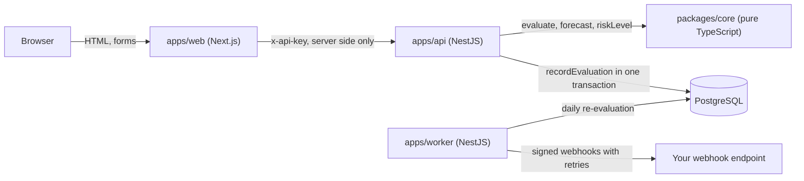

# blockpace: hotel room block attrition calculator and pickup tracker

[](https://github.com/alihdrndm/blockpace/actions/workflows/ci.yml)

**blockpace turns a hotel room block contract and a series of pickup reports into one number a planner can act on: how much attrition damage the group owes today, and how much it is on course to owe at the cutoff date.**

It is an open source attrition calculator, pickup tracker and alerting service for event planners, travel agencies and group housing teams. It is built with TypeScript, NestJS, Next.js and PostgreSQL, and released under the MIT license.

## The problem

Take a three night group booking: 80, 70 and 50 rooms at $200 a night, with 20% allowed attrition. Your guests book 70, 50 and 30 rooms. Read the attrition clause as **cumulative**, measured on the total, and you owe **$2,000**. Read it **per night**, where each night must reach its own minimum, and you owe **$3,200** for exactly the same group at exactly the same hotel. That gap is decided by one line in the hotel contract, and spreadsheets get it wrong all the time, along with the damages percentage, tax and resell credit for rooms the hotel sold again. Worse, most planners only find out what they owe after the cutoff date, when the hotel has released the unbooked rooms and nothing can be done. blockpace does the attrition math exactly, tracks pickup report by pickup report, projects pickup to the cutoff and raises an alert while there is still time to fill rooms or renegotiate.

### Room block attrition in plain words

A **room block** is a set of hotel rooms held for your group, night by night, at a group rate. In return you sign an **attrition clause**: a promise that your guests will use most of them. **Allowed attrition** is the slack, say 20%, so on 200 contracted room nights the **minimum** is 160. Every room night below the minimum is a **shortfall**, and the hotel charges **damages** for it: shortfall room nights times the room rate times a damages percentage.

Think of it like a restaurant that holds a private room for a minimum spend. Come in under the minimum and you pay the difference anyway. The minimum is agreed in advance and the bill arrives at the end.

The detail that decides the bill is the **basis**. On a **cumulative basis** the minimum applies to the whole block, so a busy Saturday can make up for a quiet Thursday. On a **per-night basis** every night has its own minimum, and a full night never offsets an empty one, which is why the same pickup produced $2,000 or $3,200 above.

Now the part planners usually get wrong: **the number that matters is not today's shortfall, it is the projected one.** Guests keep booking until the **cutoff date**, so a block that owes $6,666.60 today can still be on track to owe nothing. blockpace measures your **pickup pace** over the last 14 days and extends it to the cutoff. That projection tells you whether to relax or to start filling rooms. Optional **resell credit** lowers the shortfall by the rooms the hotel resold, when the contract allows it.

## Quick start

You need Node.js 24, pnpm (run `corepack enable`) and Docker.

```bash
git clone https://github.com/alihdrndm/blockpace.git
cd blockpace
pnpm install
pnpm db:up && pnpm db:reset   # creates .env, starts PostgreSQL on port 5442, loads 3 demo room blocks
pnpm dev                      # API, worker, web dashboard and webhook sink, all with hot reload
```

Then open:

- **http://localhost:3020**: the dashboard with three demo room blocks and their risk.
- **http://localhost:4020/docs**: interactive OpenAPI (Swagger) documentation for the REST API.

Locally `API_KEY` is empty, so authentication is off and the API logs a warning. To run the whole stack in Docker containers with authentication on (key `local-dev-key`), use `docker compose up --build`. The examples below use that.

## Try it

Run against `docker compose up --build`. Money is in minor units (cents). Demo dates are created relative to today, so they move with the day you run it.

**1. Health check (no API key needed)**

```bash
curl localhost:4020/healthz
```
```json
{"status":"ok"}
```

**2. List room blocks with today's attrition risk** (output reduced to name, hotel, risk level, owed today, projected at cutoff)

```bash
curl -H "x-api-key: local-dev-key" localhost:4020/v1/blocks
```
```text
Sales Kickoff | Lakeside Resort  | met      | 0      | 0
TechConf      | Courtyard Annex  | at_risk  | 690240 | 105120
TechConf      | Harborview Hotel | on_track | 666660 | 0
```

The two TechConf blocks have the same rooms, rates and pickup. Only the attrition basis differs. Measured per night, Courtyard Annex is still projected to owe $1,051.20 at cutoff. Measured cumulatively, Harborview is on track to owe nothing.

**3. Calculate attrition damages without saving anything** (output reduced to the key fields)

```bash
curl -H "x-api-key: local-dev-key" -H "content-type: application/json" \
  localhost:4020/v1/calculations/attrition -d '{
  "currency": "USD",
  "terms": { "basis": "per_night", "allowedAttritionPct": 15, "damagesPct": 80 },
  "nights": [
    { "date": "2026-11-10", "contractedRooms": 45, "rateMinor": 18900, "pickedUpRooms": 40 },
    { "date": "2026-11-11", "contractedRooms": 60, "rateMinor": 18900, "pickedUpRooms": 49 },
    { "date": "2026-11-12", "contractedRooms": 60, "rateMinor": 21900, "pickedUpRooms": 44 },
    { "date": "2026-11-13", "contractedRooms": 35, "rateMinor": 21900, "pickedUpRooms": 31 }
  ]}'
```
```json
{
  "minimumRoomNights": 171,
  "pickedUpRoomNights": 164,
  "shortfallRoomNights": 9,
  "damagesMinor": 152880,
  "riskLevel": "at_risk"
}
```

**4. Every error is RFC 9457 `application/problem+json`**

```bash
curl localhost:4020/v1/blocks
```
```json
{"type":"https://github.com/alihdrndm/blockpace/blob/main/docs/ERRORS.md#UNAUTHORIZED","title":"Unauthorized","status":401,"detail":"A valid x-api-key header is required.","code":"UNAUTHORIZED","instance":"01a1170c-5a43-75e2-99d1-1da38475bd23"}
```

**5. Record a pickup report and receive a signed webhook**

Record a weak snapshot for Harborview. Use today's date and the block's four night dates from `GET /v1/blocks/01900000-0000-7000-8000-0000000000b1`:

```bash
curl -X PUT -H "x-api-key: local-dev-key" -H "content-type: application/json" \
  localhost:4020/v1/blocks/01900000-0000-7000-8000-0000000000b1/snapshots/<today> \
  -d '{"nights":[{"date":"<night 1>","pickedUpRooms":10},{"date":"<night 2>","pickedUpRooms":10},{"date":"<night 3>","pickedUpRooms":10},{"date":"<night 4>","pickedUpRooms":10}]}'
docker compose logs webhook-sink
```
The worker polls every 2 seconds, so the new line appears within a few seconds. Output reduced to the last line; the log also shows the startup message and the alerts the seed raised:

```text
webhook-sink-1  | RISK_LEVEL_CHANGED 01a1170c-7bbc-7056-b62f-3a97dd923ef4 signature OK
```

The risk level moved from `on_track` to `at_risk`. The API raised the alert in the same database transaction as the snapshot, the worker delivered it signed with HMAC-SHA256, and the local webhook sink verified the signature.

## How it works



All of the contract math lives in `packages/core`: pure TypeScript functions with no I/O, money handled as exact integers so nothing is lost to floating point rounding, and the worked examples from the specification as tests. The NestJS API stores room blocks and pickup snapshots in PostgreSQL. Every write that can change the risk calls one routine, `recordEvaluation`, inside the same transaction. It stores the evaluation, raises each alert exactly once (a unique key in the database guarantees it) and queues one webhook delivery per endpoint. The worker re-evaluates every active block daily and delivers webhooks with `FOR UPDATE SKIP LOCKED`, so several workers never send the same webhook twice. The Next.js dashboard calls the API from its server, so the browser never sees the API key. More detail in [docs/ARCHITECTURE.md](docs/ARCHITECTURE.md).

What you get:

- **Attrition calculator** for cumulative and per-night bases, with damages percentage, tax, resell credit and a choice of minimum rounding.
- **Pickup tracking**: record pickup snapshots by API, web form or CSV import, and see the pace chart against the minimum, the contracted rooms and the cutoff date.
- **Forecast and risk levels**: `met`, `on_track`, `at_risk` or `liable`, from a 14-day straight-line pickup forecast.
- **Alerts and signed webhooks** for risk changes, approaching cutoff dates (30, 14, 7, 3 and 1 day) and stale pickup reports, with HMAC-SHA256 signatures and retries with backoff. See [docs/WEBHOOKS.md](docs/WEBHOOKS.md).
- **REST API** with API key authentication, rate limiting, OpenAPI docs and [documented error codes](docs/ERRORS.md).
- **Deploy-ready** Docker images, Docker Compose and AWS infrastructure as code with SST. See [docs/DEPLOY.md](docs/DEPLOY.md).

## Verified vs assumed

blockpace gives an estimate. **The signed hotel contract always governs.** Every modelling choice that real contracts may handle differently is listed in [docs/ASSUMPTIONS.md](docs/ASSUMPTIONS.md). In short:

- The arithmetic is verified against hand-worked examples and property-based tests, with 100% test coverage in `packages/core`.
- How a contract charges a shortfall (a weighted average rate on the cumulative basis, rounding the minimum up, tax on damages, resell credit) is assumed, and configurable where the contract terms allow.
- The forecast is a simple pace indicator over the last 14 days of pickup, not a prediction model.

## Roadmap

- Review ("wash") dates and sliding-scale attrition.
- Food-and-beverage minimums and combined-revenue attrition.
- Pickup import from hotel pickup-report emails and PMS exports.
- Better forecasts using booking curves from past events.
- Slack and email notifications.
- Publish `@alihdrndm/blockpace-core` to npm.

## License

[MIT](LICENSE) © 2026 Ali Haider Nadeem
